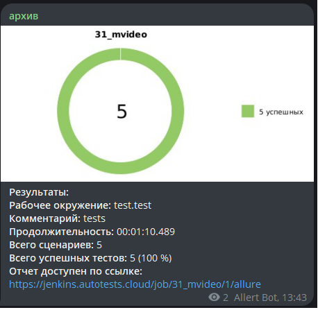
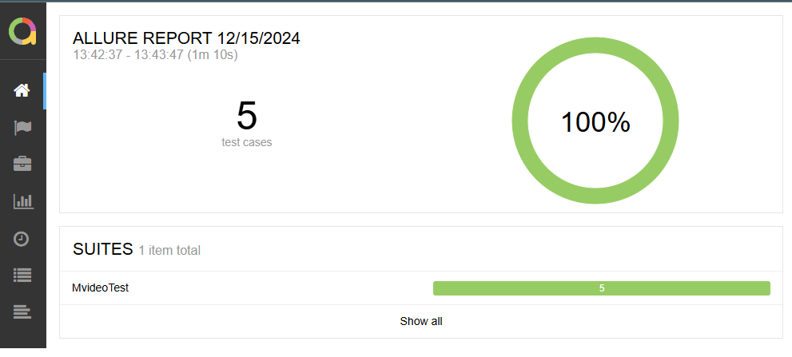
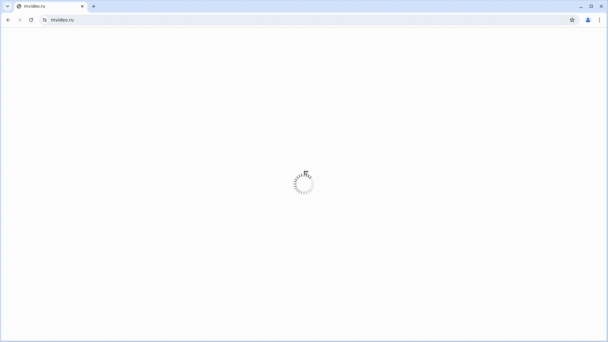

##  
## Проект автоматизации тестирования для сайта Mvideo

Проект по автоматизации тестирования для компании Mvideo с использованием инструментов Selenide, JUnit 5 и Allure.

## **Содержание:**
____

* <a href="#tools">Технологии и инструменты</a>

* <a href="#cases">Примеры автоматизированных тест-кейсов</a>

* <a href="#jenkins">Сборка в Jenkins</a>

* <a href="#console">Запуск из терминала</a>

* <a href="#allure">Allure отчет</a>

* <a href="#telegram">Уведомление в Telegram при помощи бота</a>

* <a href="#video">Примеры видео выполнения тестов на Selenoid</a>
____
<a id="tools"></a>
## Технологии и инструменты:

| Java                                                                                                      | IntelliJ  <br>  Idea                                                                                               | GitHub                                                                                                     | JUnit 5                                                                                                           | Gradle                                                                                                     | Selenide                                                                                                         | Selenoid                                                                                                                  | Allure <br> Report                                                                                                         |  Jenkins                                                                                                        | Telegram                                                                                                            |                                                                                                          
|:----------------------------------------------------------------------------------------------------------|--------------------------------------------------------------------------------------------------------------------|------------------------------------------------------------------------------------------------------------|-------------------------------------------------------------------------------------------------------------------|------------------------------------------------------------------------------------------------------------|------------------------------------------------------------------------------------------------------------------|---------------------------------------------------------------------------------------------------------------------------|----------------------------------------------------------------------------------------------------------------------------|-----------------------------------------------------------------------------------------------------------------|---------------------------------------------------------------------------------------------------------------------|
| <a href="https://www.java.com/"></a>  | <a href="https://www.jetbrains.com/idea/"></a> | <a href="https://github.com/"></a> | <a href="https://junit.org/junit5/"></a> | <a href="https://gradle.org/"></a> | <a href="https://selenide.org/"></a> | <a href="https://aerokube.com/selenoid/"></a> | <a href="https://github.com/allure-framework"></a> |<a href="https://www.jenkins.io/"></a> | <a href="https://web.telegram.org/"></a> |

<a id="cases"></a>
## Примеры автоматизированных тест-кейсов:
- Проверка отображения корзины на главной странице
- Проверка видимости номера телефона на главной странице
- Проверка видимости профиля на главной странице
- Проверка возможности входа на сайт
- Проверка доступности категории товаров на сайте

<a id="jenkins"></a>

## Сборка в Jenkins
Проект настроен для сборки через Jenkins. Параметры сборки можно передавать через интерфейс Jenkins.

### Параметры сборки:
- `browser` — браузер для тестов (по умолчанию `chrome`)
- `browserVersion` — версия браузера (по умолчанию `126.0`)
- `browserSize` — размер окна браузера (по умолчанию `1920x1080`)
- `baseUrl` — адрес тестируемого веб-сайта
- `remoteUrl` — логин, пароль и адрес удаленного сервера Selenoid
  <a id="console"></a>
### Команды для запуска из терминала
Локальный запуск:
```
gradle clean test
```
##  Уведомления в Telegram
____
<p align="center">

</p>


##  Отчет Allure
____
[Перейти к отчету Allure](https://jenkins.autotests.cloud/job/31_mvideo/allure/)

<p align="center">

</p>


## </a> Видео запуска тестов в Selenoid
____
<a id="video"></a>
<p align="center">
   
</p>